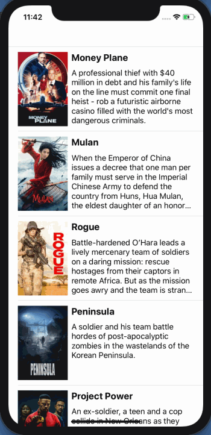
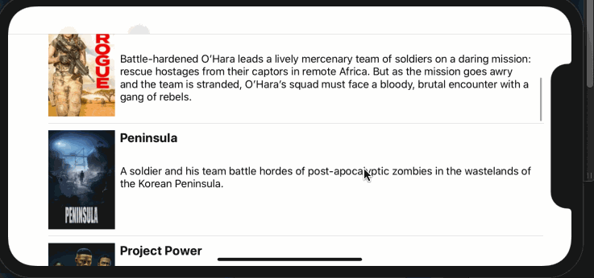

# Flix

Flix is an app that allows users to browse movies from the [The Movie Database API](http://docs.themoviedb.apiary.io/#).

## Flix Part 2

### User Stories

#### REQUIRED (10pts)
- [X] (5pts) User can tap a cell to see more details about a particular movie.
- [X] (5pts) User can tap a tab bar button to view a grid layout of Movie Posters using a CollectionView.

#### BONUS
- [ ] (2pts) User can tap a poster in the collection view to see a detail screen of that movie.
- [ ] (2pts) In the detail view, when the user taps the poster, a new screen is presented modally where they can view the trailer.

### App Walkthrough GIF

### Notes
I was running into some trouble when configuring the collection view cells because the images were tiny. However, with some help from the slack channel, I was able to figure out that it was because of the estimate size component of the collection view

---

## Flix Part 1

### User Stories

#### REQUIRED (10pts)
- [x] (2pts) User sees an app icon on the home screen and a styled launch screen.
- [x] (5pts) User can view and scroll through a list of movies now playing in theaters.
- [x] (3pts) User can view the movie poster image for each movie.

#### BONUS
- [x] (2pt) User can view the app on various device sizes and orientations.
- [x] (1pt) Run your app on a real device.

### App Walkthrough GIF

### Notes
I had a bit of trouble with the TableViewCell initially because I hadn't marked the MovieCell as the tableView identifier. Moreover, the autolayout videos on constraints were fairly confusing, but I know with more practice I will get a better hang of it. 

